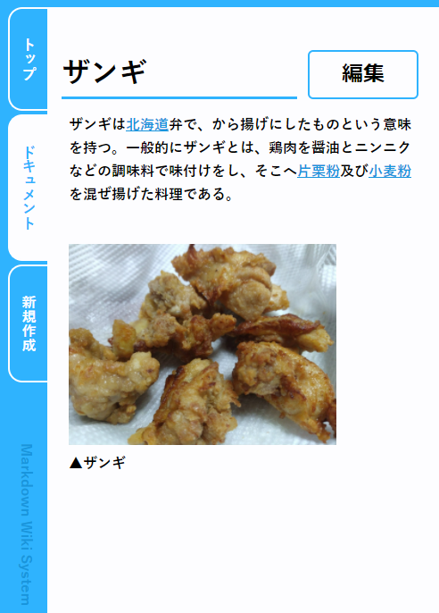

## markdown-wiki
- GitHub: [https://github.com/TomSuzuki/markdown-wiki](https://github.com/TomSuzuki/markdown-wiki)

### 説明
マークダウンで記事を作成できるタイプのWikiっぽいもの。  
サーバー側はGo言語を使用し、JavaScriptでデータの送受信を行っています。

### 画像

