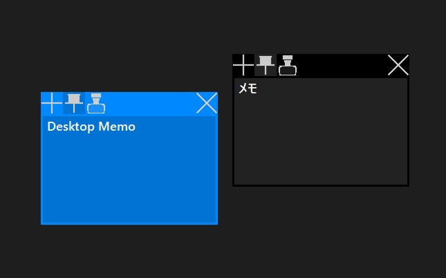

## Desktop Memo2
- GitHub: [https://github.com/TomSuzuki/DesktopMemo2](https://github.com/TomSuzuki/DesktopMemo2)

### 説明
数年前に制作した [Desktop Memo](https://github.com/TomSuzuki/DesktopMemo) の改良版。  
各ウィンドウの色の変更機能や、タスクバーではなくタスクトレイでのアプリケーションの表示、バグの修正を行っています。  
前回と同じようにHSP3を使用しています。

### 主な機能
- 最前面表示切替
- タスクトレイでの操作
- ウィンドウカラーの変更（6色）
- メモの追加、削除

※スタートアップに設定すれば、PC起動時に自動的にメモを前回と同じ位置に貼り付けます。

### 画像

